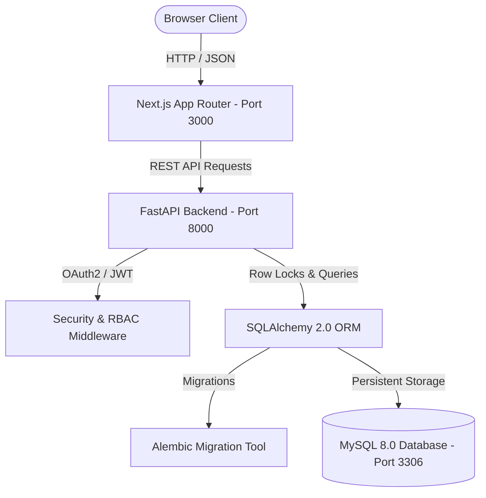
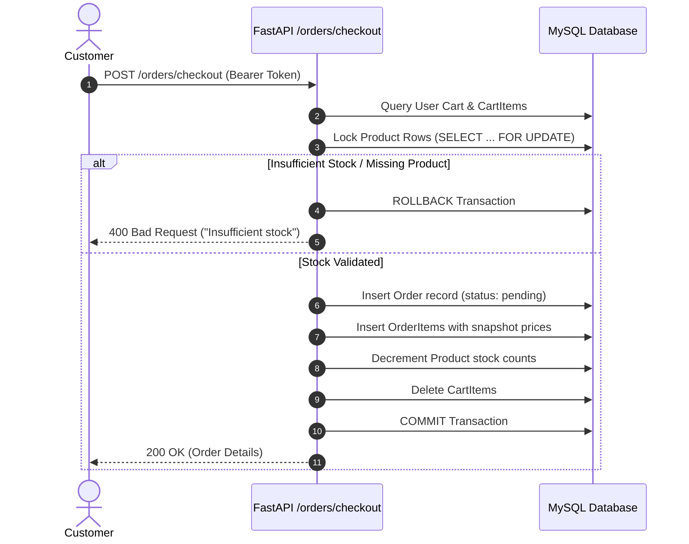

# ShopSphere — Production-Ready Full-Stack E-Commerce Platform

ShopSphere is a robust, full-stack e-commerce web application built with **FastAPI**, **Next.js**, **SQLAlchemy**, and **MySQL**. It features JWT authentication, Role-Based Access Control (RBAC), stock validation with row-level database locking (`SELECT ... FOR UPDATE`), transaction rollback guarantees, administrative CRUD portals, and responsive UI states.

---

## 1. Project Overview

ShopSphere delivers a modern, high-performance shopping experience:
- **Customer Storefront**: Product browsing with debounced search, category filtering, dynamic sorting, pagination, cart operations, atomic checkout, and order history.
- **Admin Management Portal**: Administrative controls for product catalog management, category organization with product-dependency checks, and order fulfillment state transitions.
- **High Concurrency Protection**: Pessimistic database row locking during checkout to prevent race conditions, overselling, and inventory discrepancies.

---

## 2. Key Features

- **Authentication & Security**:
  - Secure registration and login using passlib bcrypt hashing.
  - Stateless JSON Web Tokens (JWT) using the `HS256` signature algorithm.
  - Role-based authorization (`admin` vs `user`) protecting privileged endpoints with HTTP 403 Forbidden.
  - Sanitized responses ensuring passwords and sensitive credentials are never leaked.
- **Product Catalog**:
  - Full-text case-insensitive product search across name and description.
  - Filter by category with real-time UI synchronization.
  - Multi-attribute sorting (`price_asc`, `price_desc`, `name_asc`, `name_desc`).
  - Server-side pagination (`skip` and `limit`).
- **Cart & Concurrency-Safe Checkout**:
  - Persistent user cart tied directly to database models.
  - Dynamic quantity updating with live stock availability limits.
  - Row-level database locking during checkout (`with_for_update()`).
  - Atomic transaction rollback on insufficient stock or invalid items.
- **Order Lifecycle & State Machine**:
  - Strict order state transitions enforced at the database and API level:
    - `pending` → `confirmed` | `cancelled`
    - `confirmed` → `shipped` | `cancelled`
    - `shipped` → `delivered`
    - `delivered` and `cancelled` are terminal states.
- **UI & UX Polish**:
  - Fully responsive layout for desktop, tablet, and mobile with a hamburger menu.
  - Skeleton loading states and empty result states.
  - Instant client-side authentication synchronization.

---

## 3. System Architecture



### Checkout Transaction Flow



---

## 4. Tech Stack

| Layer | Technology | Description |
|---|---|---|
| **Frontend** | Next.js 16 (App Router) | React 19, Vanilla JavaScript (ES6+), Tailwind CSS |
| **Backend** | FastAPI 0.141+ | Modern, high-performance Python ASGI web framework |
| **Database ORM** | SQLAlchemy 2.0 | Python SQL toolkit with declarative data mapping |
| **Database** | MySQL 8.0 | Relational database with InnoDB engine (ACID compliant) |
| **Database Migrations** | Alembic 1.20 | Programmatic database version control |
| **Security & Auth** | python-jose & passlib | JWT creation, verification, and bcrypt hashing |
| **Testing** | pytest & httpx | Automated test suites with SQLite in-memory isolation |
| **Containerization** | Docker & Docker Compose | Multi-container reproducible runtime |
| **CI/CD** | GitHub Actions | Automated linting, test suites, and production build validation |

---

## 5. Project Structure

```text
ShopSphere/
├── .github/
│   └── workflows/
│       └── ci.yml               # GitHub Actions CI workflow
├── backend/
│   ├── alembic/                 # Database migration scripts
│   │   ├── versions/            # Version revisions
│   │   └── env.py               # Alembic configuration
│   ├── app/
│   │   ├── core/                # Core configs, security, dependencies, logging
│   │   ├── db/                  # Engine, session, and base definitions
│   │   ├── models/              # SQLAlchemy database models
│   │   ├── schemas/             # Pydantic validation schemas
│   │   ├── routers/             # API route controllers
│   │   └── main.py              # Application entrypoint & CORS
│   ├── tests/                   # Pytest automated test suite
│   ├── Dockerfile               # Backend container image definition
│   ├── requirements.txt         # Python dependencies
│   └── .env.example             # Backend environment template
├── frontend/
│   ├── app/                     # Next.js App Router pages
│   ├── components/              # Shared UI components (Navbar, ProductCard)
│   ├── context/                 # React Context providers (AuthContext)
│   ├── utils/                   # Fetch and helper utilities (api.js)
│   ├── Dockerfile               # Frontend multi-stage container definition
│   └── package.json             # Frontend dependencies
├── docker-compose.yml           # Full-stack Docker compose configuration
├── .gitignore                   # Root Git ignore rules
├── .env.example                 # Root environment template
└── README.md                    # Project documentation
```

---

## 6. Database Design

### Entity Relationships
- **Users**: Unique email, hashed password, role (`user` | `admin`). Has one `Cart`, has many `Orders`.
- **Categories**: Unique name. Has many `Products`.
- **Products**: Belongs to `Category`. Has `name`, `description`, `price` (Decimal), `stock` (Integer).
- **Carts**: One-to-one relationship with `User`. Has many `CartItems`.
- **CartItems**: Joins `Cart` and `Product` with `quantity`.
- **Orders**: Belongs to `User`. Tracks `total_amount` (Decimal), `status`, `created_at`. Has many `OrderItems`.
- **OrderItems**: Joins `Order` and `Product` with `quantity` and snapshot `price`.

---

## 7. Authentication Flow

1. **User Registration**: `POST /auth/register` validates input, hashes password with bcrypt, and creates a user record with default role `user`.
2. **User Login**: `POST /auth/login` accepts credentials via OAuth2 Password Request format (`username` + `password`), verifies password hash, and returns an encoded JWT access token.
3. **Session Verification**: `GET /auth/me` decodes the token from the `Authorization: Bearer <token>` header, validates token expiration, and returns the current user profile.
4. **Token Refresh & Persistence**: Tokens are stored client-side in `localStorage` and dispatched automatically via the `apiFetch` utility.

---

## 8. Authorization / Role-Based Access Control (RBAC)

The application enforces RBAC using FastAPI's dependency injection system:

```python
def require_admin(current_user: User = Depends(get_current_user)):
    if current_user.role != "admin":
        raise HTTPException(
            status_code=status.HTTP_403_FORBIDDEN,
            detail="Admin access required"
        )
    return current_user
```

- Normal users are denied access to admin routes with `403 Forbidden`.
- Normal users can only access and manipulate their own carts and orders.

---

## 9. API Overview

| Method | Endpoint | Access | Description |
|---|---|---|---|
| `POST` | `/auth/register` | Public | Register new user account |
| `POST` | `/auth/login` | Public | Authenticate user & return JWT |
| `GET` | `/auth/me` | Authenticated | Retrieve current user profile |
| `GET` | `/products/` | Public | List products (search, filter, sort, paginate) |
| `GET` | `/products/{id}` | Public | Retrieve single product details |
| `POST` | `/products/` | Admin | Create new product |
| `PUT` | `/products/{id}` | Admin | Update product details |
| `DELETE` | `/products/{id}` | Admin | Delete product |
| `GET` | `/categories/` | Public | List all categories |
| `POST` | `/categories/` | Admin | Create category |
| `PUT` | `/categories/{id}` | Admin | Update category |
| `DELETE` | `/categories/{id}` | Admin | Delete category (guards against existing products) |
| `GET` | `/cart/` | Authenticated | Get current user's cart |
| `POST` | `/cart/items` | Authenticated | Add item to cart |
| `PUT` | `/cart/items/{product_id}` | Authenticated | Update item quantity |
| `DELETE` | `/cart/items/{product_id}` | Authenticated | Remove item from cart |
| `DELETE` | `/cart/` | Authenticated | Clear user's cart |
| `POST` | `/orders/checkout` | Authenticated | Concurrency-safe atomic checkout |
| `GET` | `/orders/` | Authenticated | List current user's order history |
| `GET` | `/orders/admin` | Admin | List all orders across all customers |
| `PUT` | `/orders/admin/{order_id}/status` | Admin | Transition order status |

Interactive OpenAPI documentation is available locally at:
- **Swagger UI**: `http://localhost:8000/docs`
- **ReDoc**: `http://localhost:8000/redoc`

---

## 10. Local Setup & Installation

### Prerequisites
- Python 3.10+
- Node.js 18+ & npm
- MySQL Server 8.0+

### Step 1: Clone Repository
```bash
git clone https://github.com/your-username/ShopSphere.git
cd ShopSphere
```

### Step 2: Configure Environment Variables
Copy the template files:
```bash
cp backend/.env.example backend/.env
```
Update `backend/.env` with your local database credentials and a secure `SECRET_KEY`.

### Step 3: Set up Backend
```bash
cd backend
python -m venv venv

# On Windows:
.\venv\Scripts\activate
# On Linux/macOS:
source venv/bin/activate

pip install -r requirements.txt
```

### Step 4: Apply Database Migrations
```bash
alembic upgrade head
```

### Step 5: Run Backend Server
```bash
uvicorn app.main:app --reload --port 8000
```

### Step 6: Set up Frontend
In a new terminal window:
```bash
cd frontend
npm install
npm run dev
```
Visit `http://localhost:3000` in your browser.

---

## 11. Running Automated Tests

The backend test suite uses `pytest` with an isolated SQLite in-memory database to ensure developer database data is never modified:

```bash
cd backend
.\venv\Scripts\activate   # or source venv/bin/activate
pytest tests/ -v
```

All 46 test cases cover:
- Authentication & JWT issuance/validation
- RBAC protection & unauthorized access rejection
- Product catalog search, filter, sort, and pagination
- Category CRUD & foreign key deletion guards
- Cart operations & inventory boundary checks
- Atomic order checkout & state machine transitions

---

## 12. Docker Setup

To build and run the entire application stack (MySQL, FastAPI, Next.js) using Docker Compose:

```bash
docker compose up --build
```

- **Frontend**: `http://localhost:3000`
- **Backend API**: `http://localhost:8000`
- **API Documentation**: `http://localhost:8000/docs`

To stop and remove containers:
```bash
docker compose down
```

---

## 13. Continuous Integration (CI/CD)

The GitHub Actions workflow (`.github/workflows/ci.yml`) executes on every push and pull request to `main` and `develop`:
1. **Backend Job**: Installs dependencies and runs the complete pytest test suite.
2. **Frontend Job**: Installs dependencies and verifies that the Next.js production build compiles with zero errors.

---

## 14. Future Improvements

- Stripe / Razorpay webhook integration for credit card and UPI payments.
- Asynchronous email order receipts via Celery or background tasks.
- Redis cache layer for high-throughput product catalog queries.
- Refresh token rotation for extended user sessions.
